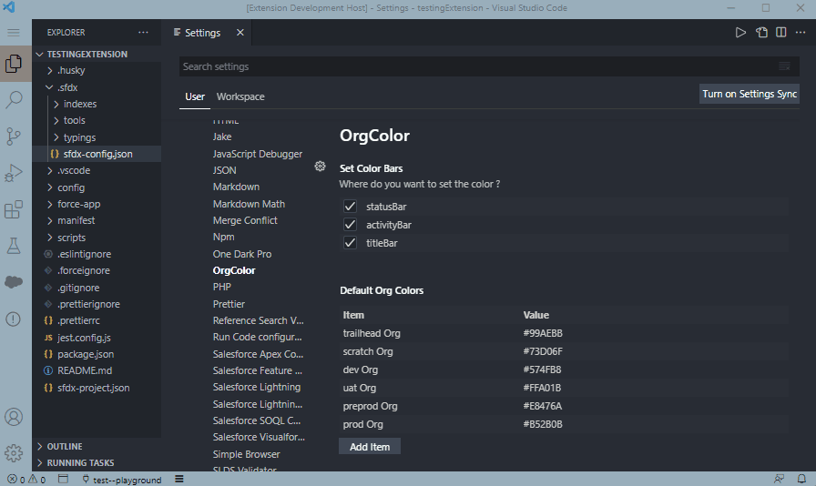
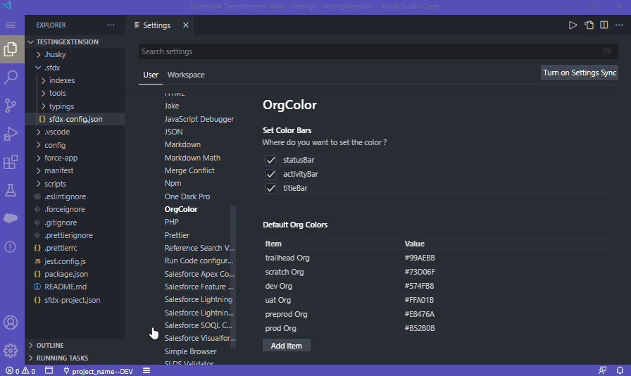
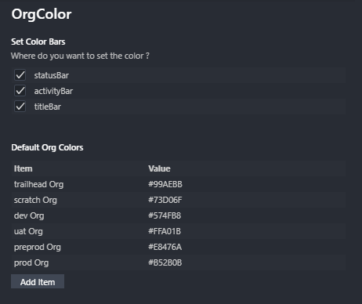
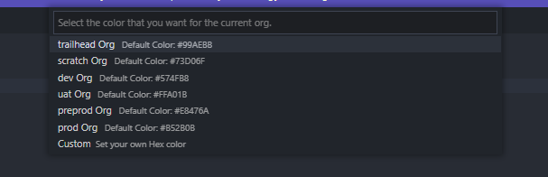

# Org Color Indicator

This extension adds the possibility to set colors for each Salesforce org that you work with, updating it automatically when you switch orgs.
It allows you to keep an eye on which org you are currently working with in a more visual way.

## Requirements

This extension requires you to have the [Salesforce Extension Pack
](vscode:extension/salesforce.salesforcedx-vscode) installed.

## Using it with a new org

## Settings in more detail

### Where configured org colors are saved

It saves your Org Color settings at `~/.sfdx/orgColor.json` on linux, and at `%userprofile%\.sfdx\orgColor.json` on windows. That way it stays in the same place as the authorized org settings.

### Default colors

-  `"trailhead Org": "#99AEBB"`
-  `"scratch Org": "#73D06F"`
-  `"dev Org": "#574FB8"`
-  `"uat Org": "#FFA01B"`
-  `"preprod Org": "#E8476A"`
-  `"prod Org": "#B52B0B"`

